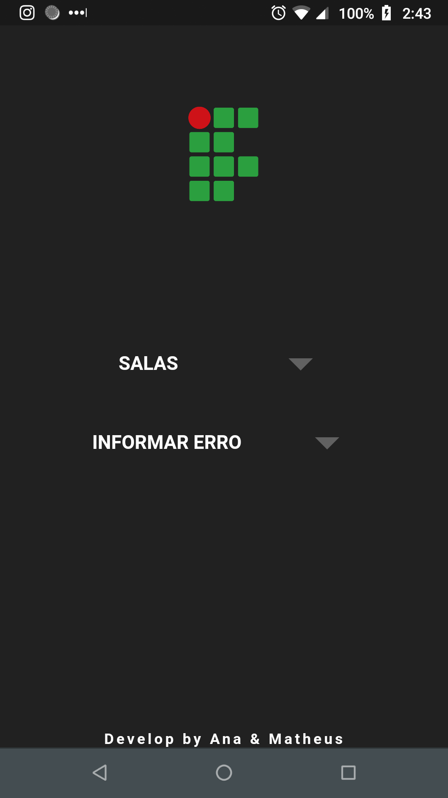

<h1 align="center">Welcome to AnalyseRoom 👋</h1>

  
  

## Description and Screenshots

  

Final paper of IT course on IFF. It's a door unlocking system with biometry lock.

There's a Mobile App that allows the user to know which professor is inside the room and the entry/left schedules.

The project has three parts:

1. [Arduino Part](https://github.com/Mdsp9070/AnalyseRoom/tree/master/sensor/sensor_code)
2. [PHP Web Server](https://github.com/Mdsp9070/AnalyseRoom/tree/master/webserver/webserver)
3. [Mobile App](https://github.com/Mdsp9070/AnalyseRoom/tree/master/analyseroom/analyseroom)

### ✨ [Demo](https://youtu.be/9jUqSHhrxhc)

## 📝 License

This project is [Apache 2.0](https://github.com/Mdsp9070/AnalyseRoom/blob/master/LICENSE) licensed.

## Author

👤 **Matheus <matheus_pessanha2001@outlook.com>**

* Twitter: [@matdsoupe](https://twitter.com/matdsoupe)
* Github: [@Mdsp9070](https://github.com/Mdsp9070)
* LinkedIn: [@mdsp](https://linkedin.com/in/mdsp)
